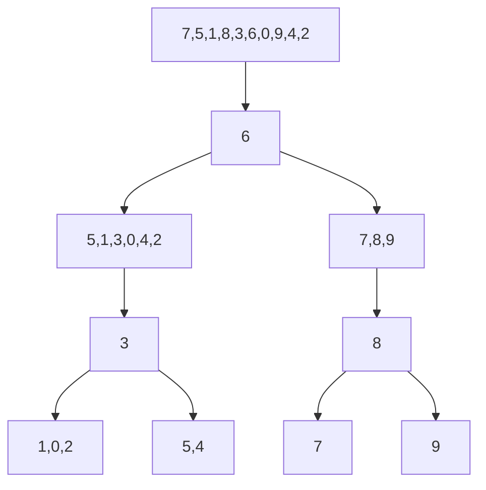

# BINARY SEARCH TREE

Abdullah Demirkol'a patika.dev sitesinde [ademirkol](https://app.patika.dev/ademirkol) kullanıcı adı ile ulaşabilirsiniz.

## Patika.dev'de veri yapıları kursu için yapılan proje

## **SORU 1 -** [7, 5, 1, 8, 3, 6, 0, 9, 4, 2] dizisinin Binary-Search-Tree aşamalarını yazınız.

> **Binary Search Tree Hatırlatma** 
> >Bir düğüm her iki tarafa da referans verebiliyor. Sağ ve sol olarak. Sağ tarafından kendinden büyük elemanlar, sol tarafında ise kendinden küçük elemanlar bulunacak.

### A - Yukarı verilen dizinin search türüne göre aşamalarını yazınız.

**Toplam islem sayısı 6**

### B - Big-O gösterimini yazınız.

 O(nlogn) -> O(6log6)